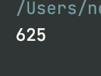
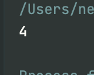
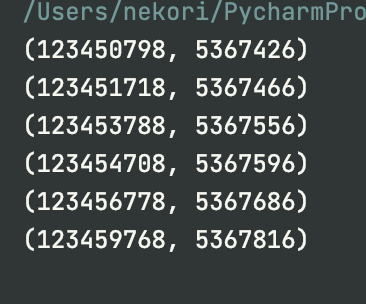

# Python. Лабораторная работа №2

<h3>Условие задач: Рассматриваются символьные последовательности длины 6 в пятибуквенном алфавите {К, А, Т, Е, Р}. Сколько существует таких последовательностей, которые начинаются с буквы Р и заканчиваются буквой К?</h3>
<h4>Описание проделанной работы: Использование модуля itertools для генерации всех возможных последовательностей и затем фильтрация их по условию.</h4>
<h4>Скриншоты результатов:</h4>
  

<h3>Условие задач: Значение выражения 216^6 + 216^4 + 36^6 − 6^14 − 24 записали в системе счисления с основанием 6. Сколько различных цифр содержит эта запись?</h3>
<h4>Описание проделанной работы: Вычисление значения выражения и перевод его в систему счисления с основанием 6, а затем подсчёт количество различных цифр в этой записи.</h4>
<h4>Скриншоты результатов:</h4>

# Условие задач: Назовём маской числа последовательность цифр, в которой также могут встречаться следующие символы:
символ ? означает ровно одну произвольную цифру; 
символ * означает любую последовательность цифр произвольной длины; в том числе * может задавать и пустую последовательность.
Например, маске 123*4?5 соответствуют числа 123405 и 12365485. Среди натуральных чисел, не превышающих 10^9, найдите все числа, соответствующие маске 12345?7?8, делящиеся на число 23 без остатка.
Запишите в первом столбце таблицы все найденные числа в порядке возрастания, а во втором столбце — соответствующие им результаты деления этих чисел на 23.

## Описание проделанной работы: Необходимо найти все натуральные числа, не превышающие $10^9$, которые соответствуют маске 12345?7?8 и делятся на 23 без остатка.

## Скриншоты результатов:
  

<h3>Ссылки на используемые материалы: 
https://www.python.org/doc/
https://habr.com/ru/companies/otus/articles/529356/
https://docs.python.org/3/library/itertools.html
https://proglib.io/p/iteriruemsya-pravilno-20-priemov-ispolzovaniya-v-python-modulya-itertools-2020-01-03
</h3>
